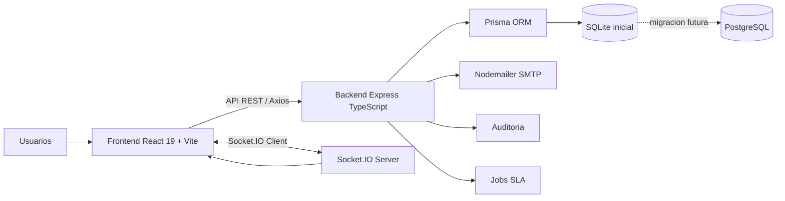

# Diagrama de arquitectura

```mermaid
flowchart LR
  U[Usuarios] --> F[Frontend React 19 + Vite]
  F -->|API REST / Axios| B[Backend Express TypeScript]
  F <-->|Socket.IO Client| S[Socket.IO Server]
  B --> P[Prisma ORM]
  P --> DB[(SQLite inicial)]
  DB -. migracion futura .-> PG[(PostgreSQL)]
  B --> M[Nodemailer SMTP]
  B --> A[Auditoria]
  B --> SLA[Jobs SLA]
  S --> F
```
