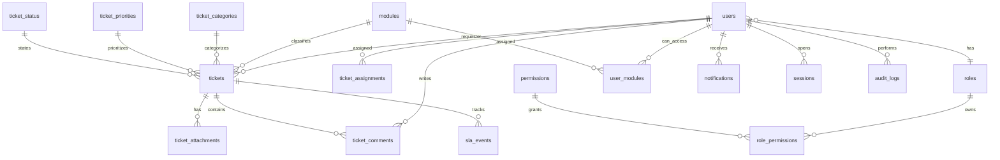

# Diagrama ER

```mermaid
erDiagram
  users ||--o{ tickets : requester
  users ||--o{ ticket_comments : writes
  users ||--o{ ticket_assignments : assigned
  users }o--|| roles : has
  roles ||--o{ role_permissions : owns
  permissions ||--o{ role_permissions : grants
  users ||--o{ user_modules : can_access
  modules ||--o{ user_modules : assigned
  modules ||--o{ tickets : classifies
  ticket_categories ||--o{ tickets : categorizes
  ticket_priorities ||--o{ tickets : prioritizes
  ticket_status ||--o{ tickets : states
  tickets ||--o{ ticket_comments : contains
  tickets ||--o{ ticket_attachments : has
  tickets ||--o{ sla_events : tracks
  users ||--o{ notifications : receives
  users ||--o{ sessions : opens
  users ||--o{ audit_logs : performs
```
